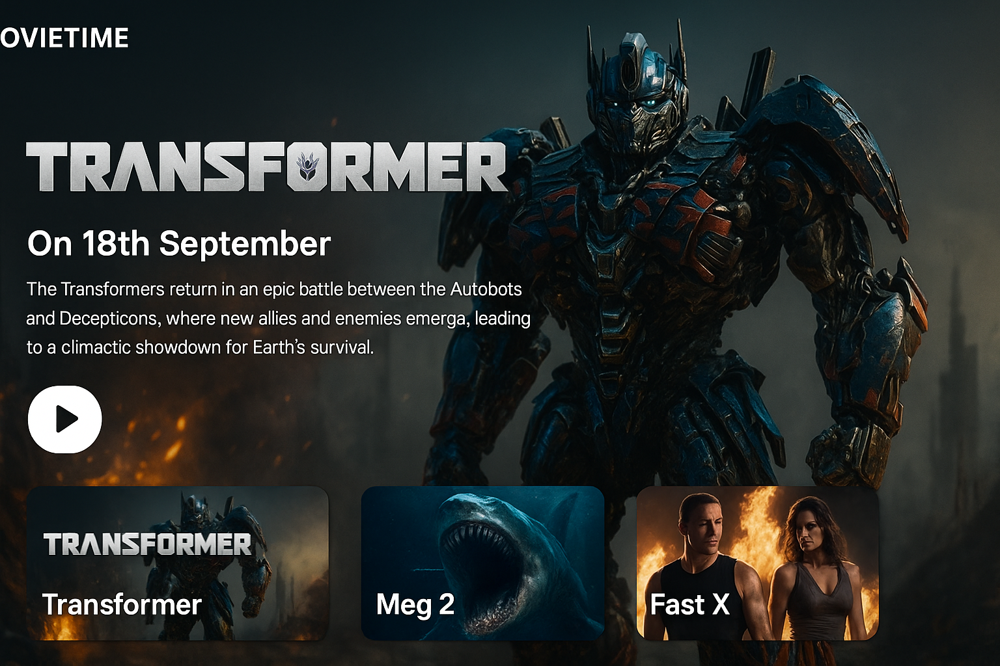

---

# 🎬 MovieTime – A Sleek Movie Showcase App

Welcome to **MovieTime**, a dynamic React-based movie showcase platform that allows users to browse and explore trending films with beautiful visuals, dates, and descriptions.

 

## 🚀 Features

* 🖼️ Movie posters and background banners
* 📅 Release dates displayed dynamically
* 📝 50-word movie descriptions
* ▶️ Interactive play buttons
* 🔄 Swiper navigation for featured movies
* 💻 Responsive design for all devices
* 🔧 Easily extensible with new movies

## 📂 Project Structure

```
/public
  /images        # All movie images (JPG/PNG)
  movieData.json # Movie info (JSON)

/src
  /components    # All React components
    MovieContent.jsx
    MovieDate.jsx
    PlayBtn.jsx
    MovieSwiper.jsx
  App.jsx
  Banner.jsx
  index.js
```

## 🛠️ Technologies Used

* React
* CSS (custom styling)
* Swiper.js
* Fetch API (for local JSON)
* Git & GitHub

## 🧪 Getting Started

1. **Clone the repo**

   ```bash
   git clone https://github.com/Cfuna22/movie-app.git
   cd movie-app
   ```

2. **Install dependencies**

   ```bash
   npm install
   ```

3. **Run the development server**

   ```bash
   npm start
   ```

## 📦 Deployment

You can deploy it using:

* **[Nelify](https://nelify.com/)**


Make sure to point to your `build/` folder.

## 📄 License

This project is licensed under the MIT License. Feel free to use and customize it.

## ✨ Author

**Abel Sifuna**
GitHub: [@Cfuna22](https://github.com/Cfuna22)
Passionate about full-stack development, design, and impactful web experiences.

